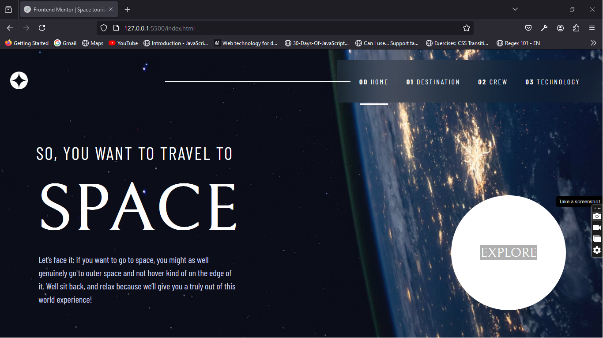

# Frontend Mentor - Space tourism website solution

This is a solution to the [Space tourism website challenge on Frontend Mentor](https://www.frontendmentor.io/challenges/space-tourism-multipage-website-gRWj1URZ3). Frontend Mentor challenges help you improve your coding skills by building realistic projects. 

## Table of contents

- [Overview](#overview)
  - [The challenge](#the-challenge)
  - [Screenshot](#screenshot)
  - [Links](#links)
- [My process](#my-process)
  - [Built with](#built-with)
  - [What I learned](#what-i-learned)
  - [Continued development](#continued-development)
  - [Useful resources](#useful-resources)
- [Author](#author)
- [Acknowledgments](#acknowledgments)

**Note: Delete this note and update the table of contents based on what sections you keep.**

## Overview

### The challenge

Users should be able to:

- View the optimal layout for each of the website's pages depending on their device's screen size
- See hover states for all interactive elements on the page
- View each page and be able to toggle between the tabs to see new information

### Screenshot




### Links

- Solution URL: [https://github.com/Igwe0001/space-tourism-website]
- Live Site URL: [https://space-tourism-website-two-sepia.vercel.app/index.html]

## My process

### Built with

- Semantic HTML5 markup
- CSS custom properties
- Flexbox
- CSS Grid
- Mobile-first workflow


### What I learned

I was ablie to practice my css and javascript using this project. I also learned how to organise my files properly and improve my javascript skills. I learned how to use a json file in a project and how to organise my functions in javascript.

To see how you can add code snippets, see below:

```html
<main class="destination-container">
        <div class="title">
            <span><b>01</b>Pick your destination</span>
        </div>
        <div class="destination-tab">
            <div class="destination-image-container">
                <!-- Data coming from js -->
            </div>
            <div class="destination-data-Container">
                <div class="destination-tabs">
                    <button class="destination-button active" data-roll="0">Moon</button>
                    <button class="destination-button" data-roll="1">Mars</button>
                    <button class="destination-button" data-roll="2">Europa</button>
                    <button class="destination-button" data-roll="3">Titan</button>
                </div>
                <div class="destination-data-data">
                    <div class="destination-data">
                        <div class="destination-data-header">
                            <!-- Data coming from js -->
                        </div>
                        <div class="destinatiodn-data-body">
                            <!-- Data coming from js -->
                        </div>
                    </div>
                </div>
            </div>
    </main>
```
```css
.proud-of-this-css {
  .destination-button {
  margin: 1rem;
  background: none;
  border: none;
  font-size: 1.6rem;
  font-family: var(--Barlow);
  text-transform: uppercase;
  color: var(--light-blue);
  letter-spacing: 0.2rem;
  cursor: pointer;
  position: relative;

  &::after {
    content: "";
    width: 0%;
    height: 0.3rem;
    background-color: var(--light-blue);
    position: absolute;
    transition: all 0.3s ease;
    top: 135%;
    left: 5%;
  }

  &:hover {
    &::after {
      width: 90%;
    }
  }
}

.destination-button.active {
  color: white;
  &::after {
    content: "";
    width: 90%;
    height: 0.3rem;
    background-color: white;
    position: absolute;
    transition: all 0.3s ease;
    top: 135%;
    left: 5%;
  }
}

}
```
```js
async function init() {
  const data = await fetchData();
  if (data) {
    if (window.location.pathname === "/pages/destination.html") {
      handleDestinations(data.destinations);
    } else if (window.location.pathname === "/pages/crew.html") {
      handleCrew(data.crew);
    } else if (window.location.pathname === "/pages/technology.html") {
      handleTechnology(data.technology);
    }
  }
}

```


### Continued development

I would like to continue working on projects to improve my skills but from now on I would be using react.js in order to improve my react skills.


### Useful resources

- [https://www.udemy.com/course/advanced-css-and-sass/?couponCode=ST16MT70224](https://www.example.com) - This helped me in organizing my sass properly. 


## Author


- Frontend Mentor - [@Igwe0001](https://www.frontendmentor.io/profile/yourusername)
- Twitter - [@Nwobodo_Igwe](https://www.twitter.com/yourusername)


## Acknowledgments
I would like to thank frontendmentor for it's commitment to helping front-end developers improve their skills.


